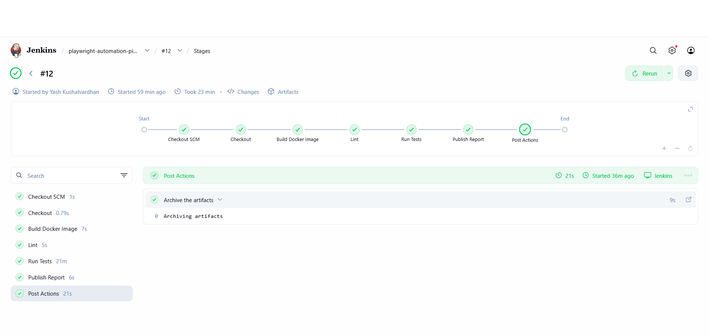
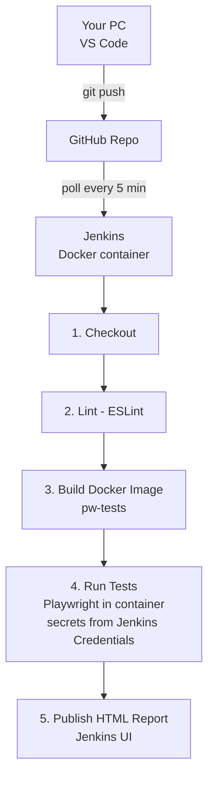
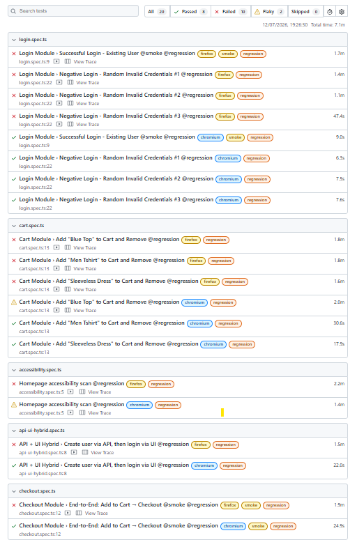
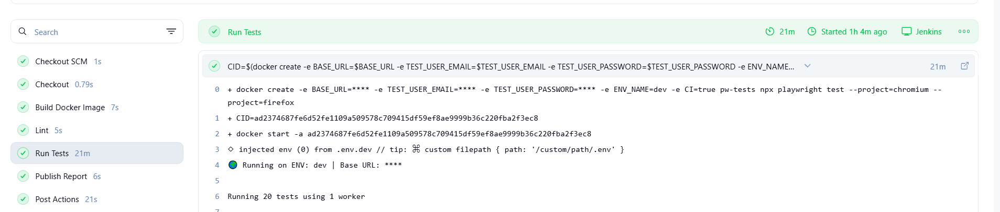
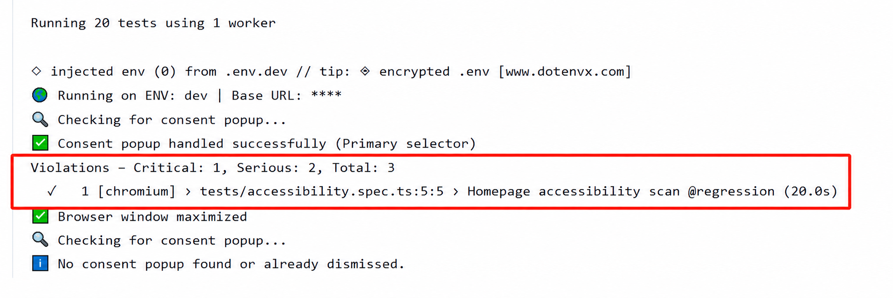

## Pipeline in Action



# Playwright Automation Framework

A production-style end-to-end test automation framework built with **Playwright + TypeScript**, targeting [automationexercise.com](https://automationexercise.com). Demonstrates Page Object Model design, data-driven testing, API+UI hybrid flows, accessibility scanning, containerization, and a fully automated Jenkins CI/CD pipeline.

## Architecture



## Tech Stack

| Layer | Tools |
|---|---|
| Test Framework | Playwright, TypeScript |
| Design Pattern | Page Object Model (POM) |
| Test Data | `@faker-js/faker` (dynamic), static fixtures |
| Config | `dotenv` + `cross-env` (multi-environment: dev/stage) |
| API Testing | Playwright's built-in `request` fixture |
| Accessibility | `@axe-core/playwright` (WCAG 2 A/AA) |
| Containerization | Docker (official `mcr.microsoft.com/playwright` image) |
| CI/CD | Jenkins (Declarative Pipeline) |
| Code Quality | ESLint (flat config) |

## Test Coverage

| Module | Scenarios | Tags |
|---|---|---|
| Login | Positive login, 3× randomized negative login (Faker) | `@smoke` `@regression` |
| Cart | Add/remove across 3 products (data-driven) | `@regression` |
| Checkout | Full E2E: browse → cart → checkout | `@smoke` `@regression` |
| API + UI Hybrid | Create user via API → login via UI → cleanup via API | `@regression` |
| Accessibility | Homepage WCAG 2 A/AA scan via Axe-core | `@regression` |

**~20 test cases** across 5 spec files, tagged for selective execution (`--grep @smoke` for fast feedback, `--grep @regression` for full suite).



## How to Run

### Locally
```bash
npm install
npx playwright install

npm run test:dev -- --project="Google Chrome" --headed     # dev env, headed
npm run test:dev -- --grep @smoke                            # smoke only
npm run lint                                                  # code quality check
```

### Docker
```bash
docker build -t pw-tests -f docker/Dockerfile .
docker-compose up --build
```

### CI (Jenkins)
Pipeline auto-triggers on every push to `main` (Poll SCM, 5-min interval). Stages: **Checkout → Lint → Build Docker Image → Run Tests → Publish Report**. Test credentials are managed via Jenkins Credentials Store (never committed in plaintext).


*Credentials securely masked in console output via Jenkins Credentials Store*

## Environment Configuration

Two environments supported via `.env.dev` / `.env.stage` (gitignored — see `.env.example` for required keys). Switch environments with:
```bash
npm run test:dev
npm run test:stage
```

## Challenges & Solutions

| Challenge | Solution |
|---|---|
| Jenkins `.inside()` silently dropped `node_modules` baked into the Docker image (workspace mount override) | Switched to `docker create` + `docker start -a` + `docker cp` pattern to bypass the mount |
| 4 parallel workers caused resource contention and cascading timeouts inside the resource-constrained Jenkins container | Forced `CI=true` → single-worker sequential execution + extended CI timeout (60s vs 30s local) |
| automationexercise.com serves real third-party ads that intercept clicks, especially under Docker's limited resources | Documented as a known third-party flakiness pattern rather than a framework bug; not "fixed" since it's outside our control |
| ESLint v9+ deprecated `.eslintrc.json` | Migrated to flat config (`eslint.config.js`) |
| Windows Docker Desktop's socket group ownership (`root`, not a dedicated `docker` group) blocks the standard `docker` group fix | Uses `chmod 666` on the socket as a pragmatic local-dev workaround; documented the production-correct alternative (native Linux `docker` group membership) |
| Firefox shows higher flakiness than Chromium in the Dockerized CI environment — third-party ad iframes on the demo site intercept clicks, and Firefox's rendering under resource-constrained containers recovers slower than Chromium | Primary verification and manual validation done on Chromium/Google Chrome; Firefox is included in the CI matrix for cross-browser coverage but treated as best-effort — failures there are triaged separately and are not blocking |

## Known Limitations

- **Cross-browser stability**: Chromium/Chrome is the primary, fully-verified target browser. Firefox is included in the CI matrix for broader coverage but currently shows intermittent flakiness under Docker's resource constraints combined with the demo site's live ad content — documented, not yet root-caused to a fixable degree since ads are outside our control.
- **Shared test account**: Login/cart tests currently share a single test account (`cigek50755@doefy.com`). A failed test mid-run can leave residual cart state affecting subsequent runs. A future improvement would be per-test dynamic accounts (as already demonstrated in the API+UI hybrid test) or an explicit cart-reset step in `beforeEach`.

## Accessibility Findings

Automated Axe-core scan on the demo site's homepage surfaced 3 real WCAG 2 A/AA violations (missing accessible button name, insufficient color contrast, unlabeled carousel controls) — documented via `testInfo.attach()` in the report rather than hard-failing the pipeline, since these are pre-existing issues on a third-party site outside this framework's control.



## Metrics

- **~20 test scenarios**, 2 browser projects (Chromium, Firefox)
- **Sequential CI execution**: ~15–20 min (prioritizes reliability over raw speed on constrained CI resources)
- **Zero hardcoded secrets** — all credentials via Jenkins Credentials Store / `.env` files (gitignored)
